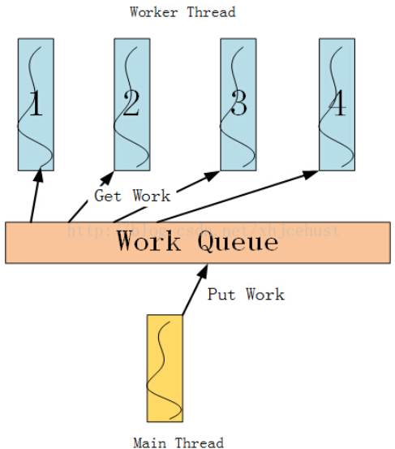

### 线程池

**不采用线程池时：**

创建线程 -> 由该线程执行任务 -> 任务执行完毕后销毁线程。即使需要使用到大量线程，每个线程都要按照这个流程来创建、执行与销毁。

虽然创建与销毁线程消耗的时间 远小于 线程执行的时间，但是对于需要频繁创建大量线程的任务，创建与销毁线程 所占用的**时间与CPU资源**也会有很大占比。

**为了减少创建与销毁线程所带来的时间消耗与资源消耗，因此采用线程池的策略：**

程序启动后，**预先创建一定数量的线程放入空闲队列中，这些线程都是处于阻塞状态，基本不消耗CPU，只占用较小的内存空间。**

接收到任务后，任务被挂在**任务队列**，线程池选择一个空闲线程来执行此任务。（RR）

任务执行完毕后，不销毁线程，线程继续保持在池中等待下一次的任务。

**线程池所解决的问题：**

(1) 需要频繁创建与销毁大量线程的情况下，由于线程预先就创建好了，接到任务就能马上从线程池中调用线程来处理任务，**减少了创建与销毁线程带来的时间开销和CPU资源占用**。

(2) 需要并发的任务很多时候，无法为每个任务指定一个线程（线程不够分），使用线程池可以将提交的任务挂在任务队列上，等到池中有空闲线程时就可以为该任务指定线程。


常见线程池实现原理



如上图所示，工作队列由main线程和worker线程共享，主线程将任务放进工作队列，工作者线程从工作队列中取出任务执行。

共享**work queue**的操作需在互斥量的保护下安全进行，主线程将任务放进工作队列时若检测到当前待执行的工作数目小于工作者线程总数，则需使用条件变量唤醒可能处于等待状态的工作者线程。当然，还有其他地方可能也会使用到互斥量和条件变量，不再赘述。


### 手写线程池（c++）

```c++
#include <vector>
#include <queue>
#include <thread>
#include <iostream>
#include <condition_variable>
using namespace std;
 
const int MAX_THREADS = 1000; //最大线程数目
 
template <typename T>
class threadPool
{
public:
    threadPool(int number = 1);
    ~threadPool();
    bool append(T *task);
    //工作线程需要运行的函数,不断的从任务队列中取出并执行
    static void *worker(void *arg);
    void run();
 
private:
    //工作线程
    vector<thread> workThread;
    //任务队列
    queue<T *> taskQueue;
    mutex mt;
    condition_variable condition;
    bool stop;
};
```

线程池的实现就有点像是**生产消费者模型**，append()就像是生产者，不断的将任务放入队列，run()函数就像消费者，不断的从任务队列中取出任务来处理，生产消费的两头分别用notify_one()和wait()来唤醒和阻塞。


### 构造函数

构造函数中，创建N个线程(int number)，插入到工作线程当中，工作线程可以是vector结构。

```c++
template <typename T>
threadPool<T>::threadPool(int number) : stop(false)
{
    // 构造函数丢异常，好不好呢？
    if (number <= 0 || number > MAX_THREADS)
        throw exception();
    for (int i = 0; i < number; i++)
    {
        cout << "create thread：" << i << endl;
        workThread.emplace_back(worker, this);
    }
}
```

工作线程中的线程具体要做什么呢？

1. 进入线程的时候必要用unique_lock进程加锁处理，不能让其他线程以及主线程影响到要处理的这个线程。

2. 判断任务队列是否为空，如果为空，则利用条件变量中的wait函数来阻塞该线程，等待任务队列不为空之后唤醒它。

3. 然后取出任务队列中的任务，执行任务中的具体操作。


### 析构函数

```c++
template <typename T>
inline threadPool<T>::~threadPool()
{
    {
        unique_lock<mutex> unique(mt);
        stop = true;
    }
    condition.notify_all();
    for (auto &wt : workThread)
        wt.join();
}
```


### append

接着将任务放入任务队列taskQueue，这里的任务是外部根据自己的业务自己定义的，可以是对象，可以是函数，结构体等等，而任务队列这里定义为queue结构，一定要记得将任务放入任务队列的时候，**要在之前加锁，放入之后再解锁**，这里的加锁解锁可以用unique_lock结构，当然也可以用mutex，而放入任务队列之后就可以用条件变量的`notify_one()`函数**通知阻塞的线程来取任务处理了**

```c++
template <typename T>
bool threadPool<T>::append(T *task)
{
    //往任务队列添加任务的时候，要加锁，因为这是线程池，肯定有很多线程
    unique_lock<mutex> unique(mt);
    taskQueue.push(task);
    unique.unlock();
    //任务添加完之后，通知阻塞线程过来消费任务，有点像生产消费者模型
    condition.notify_one();
    return true;
}
```


### worker & run

```c++
template <typename T>
void *threadPool<T>::worker(void *arg)
{
    threadPool *pool = (threadPool *)arg;
    pool->run();
    return pool;
}
```


```c++
template <typename T>
void threadPool<T>::run()
{
    while (!stop)
    {
        unique_lock<mutex> unique(this->mt);
        //如果任务队列为空，就停下来等待唤醒，等待另一个线程发来的唤醒请求
        while (this->taskQueue.empty())
            this->condition.wait(unique);      
        T *task = this->taskQueue.front();
        this->taskQueue.pop();
        if (task)
            task->process();
    }
}
```


#### 具体使用

写一个main文件来调用线程池的相关接口，main文件里定义一个任务对象，然后是main函数。

```c++
#include "threadPool.h"
#include <string>
using namespace std;
class Task
{
private:
    int total = 0;
 
public:
    void process();
};
 
//任务具体实现什么功能，由这个函数实现
void Task::process()
{
    //这里就输出一个字符串
    cout << "task successful！ " << endl;
    this_thread::sleep_for(chrono::seconds(1));
}
 
template class std::queue<Task>;
int main(void)
{
    threadPool<Task> pool(1);
    std::string str;
    while (1)
    {
        Task *task = new Task();
        pool.append(task);
        delete task;
    }
}

```


参考：https://blog.csdn.net/xhjcehust/article/details/45844901